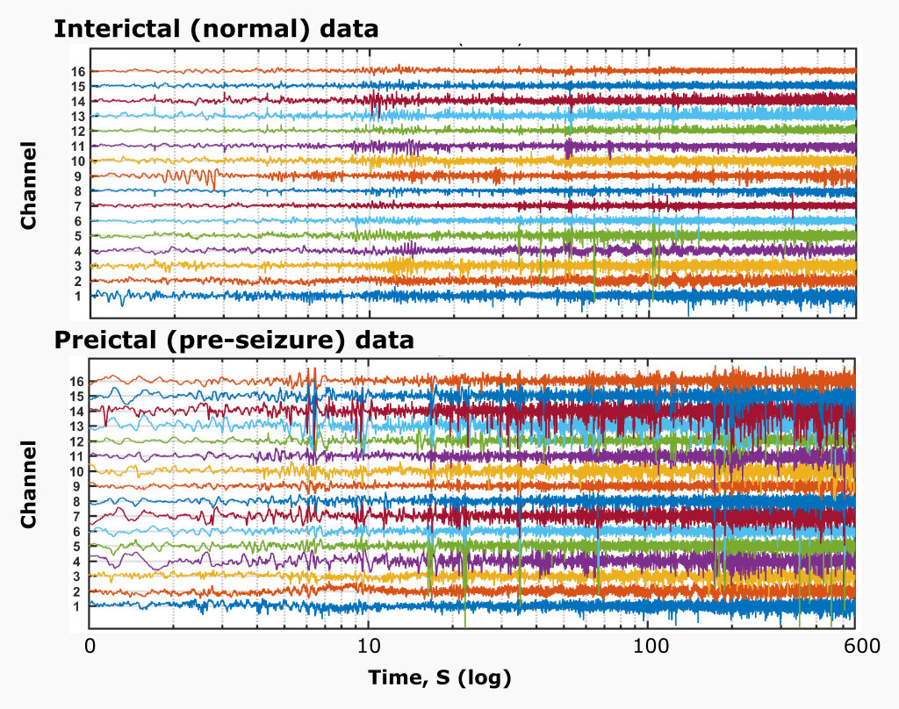
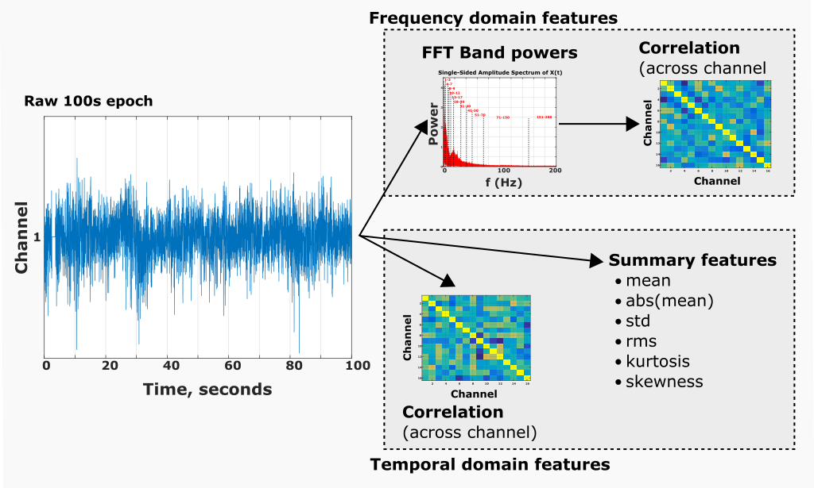
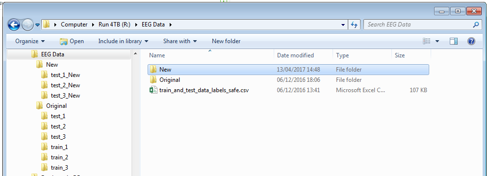
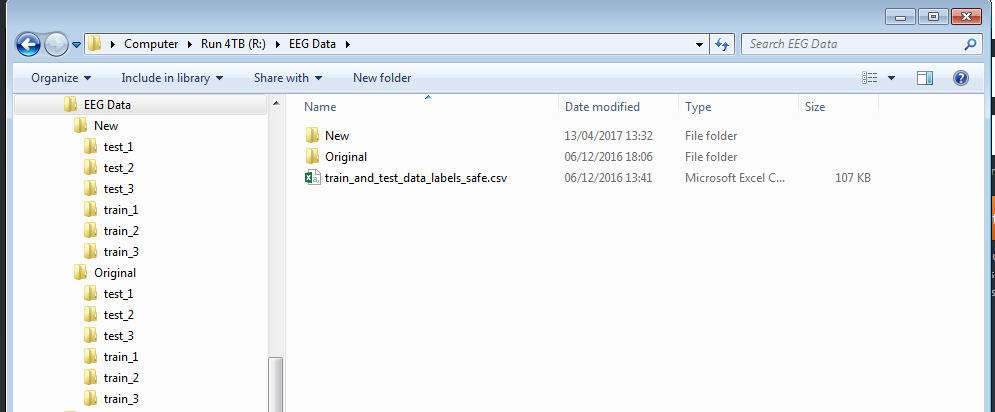

# EEG Seizure Prediction
Gareth Paul Jones  
3rd place [Melbourne University AES/MathWorks/NIH Seizure Prediction](http://blog.kaggle.com/2017/01/10/seizure-prediction-competition-3rd-place-winners-interview-gareth-jones/)  
2016

## Description
This code is designed to process the raw data from [Melbourne University AES/MathWorks/NIH Seizure Prediction](https://www.kaggle.com/c/melbourne-university-seizure-prediction), train a seizureModel (**train.m**), then predict seizure occurrence from a new test set (**predict.m**).

### Data
The raw data contains 16 channel inter-cranial EEG recordings from 3 patients. It's split in to interictal (background) periods and preictal (before-seizure) periods. 

### Features
Various feautres are extracted from the raw data, inlcuding:
  - Frequency power in EEG bands
  - Summary statistics in the temporal domain
  - Correlation between channels in the frequency and temporal domains
  
These features are extracted with various windows sizes (240, 160, and 80s in the 3rd place submission) and are combined in to a single data set before training the models. Processed features are saved to disk for faster subsequent loading.
  
  

### Models
Two models are fit to the processed data:
  - An RUS Boosted tree ensemble
  - A Quadratic SVM
  
These models are handled by the seizureModel object and are fit to all the data, rather than individual models being trained for each subject. The predictions of each model are ensembled with a simple mean, which produces a considerably better score than either model alone.

  

# Running
Training and prediction stages can be run independently from their respective scripts, or together from **testRun.m**. If running from **testRun.m** paths need to be set in **predict.m** and **train.m** first. Warning: **testRun.m** is designed to run entirely from scratch and *deletes all .mat files from the working directory when it starts!*

Both **predict.m** and **train.m** expect the same directory structure as provided for the competition, and training is specifically written to handle the temporal relationships in this dataset - it would need modification to work correctly with new data.

 - Extract the original Kaggle data to a folder, eg. R:\EEG Data\Original\  

- Set paths the paths *params.paths.dataDir* and *params.paths.or* in **predict.m** and **train.m**
  - *params.paths.or* should be the path to the "Original" folder created above.
  - *params.paths.dataDir* will be where the actual training and test will be copied to. eg. R:\EEG Data\New\ 

- Run **train.m** 
  - The first function **copyTestLeakToTrain.m** creates a new training/test set in *params.paths.dataDir*. This set will be used for training and the folder structure should look something like this:  

 
- Run **predict.m**

Processed features and final submission file are saved in to working directory to save time on subsequent runs.

# Scripts
**train.m** script:
 - Processes raw data
	- Creates new test set from original test and training sets
 - Extracts features and saves in featuresObject (*featuresTrain*)
 - Trains an SVM and RUS boosted tree ensemble, saves the compact version of these.

**predict.m** script:
 - Loads trained models (SVM and tree ensemble saved as seizureModel objects)
 - Loads new data
   - Extracts features and saves in a featuresObject (*featuresTest*) 
 - Predicts new data
   - Reduces epoch predictions to segment predictions
   - Ensembles SVM and tree ensemble
 - Saves in to .csv submission file as per Kaggle specification

# Classes
**featuresObject**
  - Handles extraction of features and combination of features generated using different window lenghts.  
**seizureModel** 
  - Handles training of SVM or RBT.  
**cvPart** 
  - Used instead of MATLAB's cvpartition object to handle cross-validation. Allows grouping of subject data from consecutive time periods in the training set, preventing data leak that otherwise leads to over optimistic scoring of the model's performance locally.

# Requirements
 - Original Kaggle data or trained models
 - MATLAB 2016b:
  - Statistics and Machine Learning Toolbox

# Notes
 - If seeds are now setting correctly, should score ~0.8059 (= 2nd place)
 - Uses new version of featuresObject that holds only one dataset, rather than both train and test sets
 - All parallel processing has been removed for hold out testing
 - All figures should be suppressed in prediction stage

# To do
 - Save *use* structure and params.divS to each seizureModel
 - Add feature descriptions
